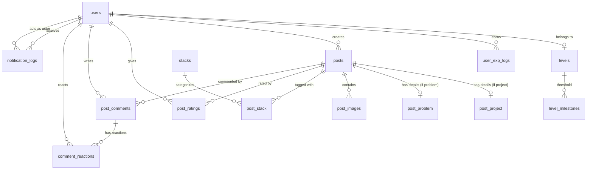

# Project Overview: Valor (Developer Social Network)

Valor adalah platform media sosial yang dirancang khusus untuk para developer (gabungan konsep microblogging ala **Threads / X**, showcase ala **GitHub / ProductHunt**, diskusi error ala **StackOverflow**, serta sistem reputasi berbasis **RPG Gamification**).

---

## 1. Visi & Konsep Utama

- **Social Feed for Devs**: Berbagi update, proyek yang sedang dibuat, maupun kendala teknis (debugging/problem) dalam format ringkas dan interaktif.
- **Dual Post Types**:
  1. **Project Post**: Berbagi aplikasi/karya lengkap dengan live demo URL, repository GitHub, tech stacks, dan screenshot.
  2. **Problem Post**: Meminta bantuan/diskusi terkait bug, arsitektur, atau error coding dengan cuplikan gambar atau deskripsi detail.
- **Gamification & Reputation System**:
  - Developer mendapatkan **EXP** dari berbagai aktivitas (membuat post, membantu menyelesaikan problem, mendapatkan rating/upvote).
  - Terdapat **Level & Milestone Rewards** untuk meningkatkan status dan reputasi developer di komunitas.
- **Community & Trending**:
  - Eksplorasi topik dan teknologi berdasarkan hashtag trending (`#problemsolving`, `#machinelearning`, dsb.) dan tech stacks (React, Next.js, Go, PostgreSQL, dll.).

---

## 2. Entity Relationship Diagram (ERD)

---

## 3. Spesifikasi Database Schema

### A. Modul User & Gamifikasi
| Tabel | Kolom Utama | Deskripsi |
| :--- | :--- | :--- |
| `users` | `id`, `username`, `email`, `email_verified_at`, `description`, `password`, `exp`, `level_id`, `created_at`, `updated_at` | Data akun pengguna, akumulasi EXP, dan level saat ini. |
| `levels` | `id`, `level_number`, `exp_required`, `title` | Master data tingkatan level (contoh: Junior Dev, Code Ninja, Architect). |
| `level_milestones` | `id`, `min_level`, `title`, `reward_desc` | Penghargaan atau badge khusus ketika mencapai ambang level tertentu. |
| `user_exp_logs` | `id`, `user_id`, `exp_amount`, `source`, `created_at` | Riwayat perolehan EXP (misal: `create_post`, `solution_accepted`, `daily_streak`). |

---

### B. Modul Konten (Posts & Stacks)
| Tabel | Kolom Utama | Deskripsi |
| :--- | :--- | :--- |
| `posts` | `id`, `created_by`, `type`, `created_at` | Tabel induk post (`type`: `'project'` atau `'problem'`). |
| `post_project` | `id`, `post_id`, `title`, `description`, `demo_url`, `repository_url` | Data spesifik proyek (live demo & repo link). |
| `post_problem` | `id`, `post_id`, `title`, `description` | Data spesifik masalah atau bug coding. |
| `stacks` | `id`, `title` | Master data teknologi/stack (contoh: Next.js, Rust, Docker). |
| `post_stack` | `id`, `post_id`, `stack_id` | Pivot relasi many-to-many antara post dan teknologi. |
| `post_images` | `id`, `post_id`, `image_size`, `image_url` | Media gambar/screenshot yang dilampirkan pada postingan. |

---

### C. Modul Interaksi & Notifikasi
| Tabel | Kolom Utama | Deskripsi |
| :--- | :--- | :--- |
| `post_ratings` | `id`, `post_id`, `user_id`, `score`, `created_at`, `updated_at` | Skor rating/evaluasi proyek atau postingan dari komunitas. |
| `post_comments` | `id`, `post_id`, `user_id`, `content`, `created_at`, `updated_at` | Komentar dan diskusi pada postingan. |
| `comment_reactions` | `id`, `comment_id`, `user_id`, `type`, `created_at` | Reaksi pada komentar (like, upvote, rocket, bug, dsb.). |
| `notification_logs` | `id`, `user_id`, `actor_id`, `type`, `reference_id`, `message`, `is_read`, `created_at` | Notifikasi aktivitas pengguna (`comment`, `rating`, `exp_earned`, dll.). |

---

## 4. Topik Brainstorming & Pertimbangan Arsitektur

Berikut beberapa poin krusial untuk didiskusikan bersama:

1. **Polymorphic / Subtype Post (Project vs Problem)**:
   - Saat ini dipisah menjadi `post_project` dan `post_problem`. Apakah nanti mungkin ada tipe post ketiga, misalnya **"General/Article/Thought"** (seperti tweet santai developer tanpa project/problem)?
2. **Sistem Problem Solving (Solusi / Accepted Answer)**:
   - Untuk `post_problem`, apakah perlu ada flag `is_solved` dan komentar mana yang ditandai sebagai `accepted_solution` (seperti di StackOverflow/GitHub Discussions)? User yang solusinya diterima bisa dapat bonus EXP besar.
3. **Mekanisme Rating vs Like**:
   - `post_ratings` menggunakan kolom `score` (skala 1-5 atau 1-10). Apakah cocok untuk semua post, ataukah `post_problem` lebih cocok memakai upvote/bookmark, sedangkan `post_project` memakai rating?
4. **Karakter ID (String vs CUID / UUID vs Auto-increment)**:
   - Di schema mentah tertulis `id string pk`. Sebaiknya di Prisma menggunakan `cuid()` atau `uuid()` agar URL rapi dan aman dibanding auto-increment.
5. **Followers & Social Graph**:
   - Apakah platform ini akan memiliki fitur **Follow / Following** antar developer?
